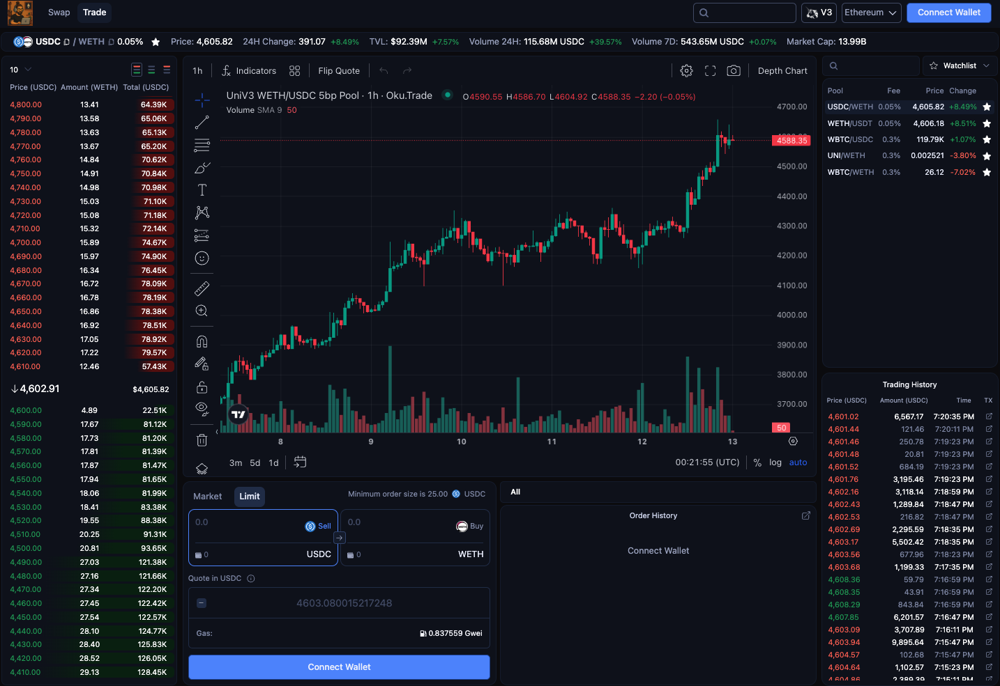

# DEX TRADING TERMINAL 📈 📉

DEX trading terminal using Uniswap V3.



## Overview

This is DEX trading terminal that combines the power of decentralized finance with professional trading tools. Users can trade tokens, manage liquidity positions, create limit orders, and perform technical analysis using industry-standard charting tools.

### Key Features

- **Advanced Trading Interface**: Professional-grade UI for token swapping and position management
- **Liquidity Pool Trading**: Direct integration with Uniswap V3 for efficient token swaps
- **Limit Orders**: Create and manage conditional orders with custom parameters
- **Real-time Charting**: TradingView integration for comprehensive technical analysis
- **Multi-chain Support**: Trade across multiple blockchain networks
- **Portfolio Management**: Track positions, orders, and trading history

## Technology Stack

### Frontend Framework

- **React 18**: Modern React with hooks and concurrent features
- **TypeScript**: Type-safe development with enhanced IDE support
- **Vite**: Fast build tool and development server

### Web3 Integration

- **wagmi**: React hooks for Ethereum development
- **viem**: TypeScript interface for Ethereum
- **Web3Modal**: Universal wallet connection interface
- **Uniswap V3 SDK**: Direct integration with Uniswap protocol

### UI/UX

- **Tailwind CSS**: Utility-first CSS framework
- **Heroicons**: Beautiful hand-crafted SVG icons
- **React Router**: Client-side routing
- **Floating UI**: Advanced positioning for tooltips and dropdowns

### Data & State Management

- **TanStack Query**: Server state management and caching
- **React Context**: Application state management
- **Firebase**: Backend services and real-time data

### Charting & Analytics

- **TradingView Charting Library**: Professional financial charts
- **ECharts**: Additional data visualization
- **Custom Data Feeds**: Real-time market data integration

### Development Tools

- **ESLint**: Code linting and formatting
- **Prettier**: Code formatting
- **Husky**: Git hooks for quality control
- **Cypress**: End-to-end testing
- **Vitest**: Unit testing framework

## Setup

### Prerequisites

- Node.js (v16 or higher)
- Yarn package manager

### Installation

```bash
# Install dependencies
yarn install

# Prepare the environment
yarn prepare

# Start development server
yarn dev
```

### Configuration

The application includes a default configuration. To customize settings:

1. Copy `example.config.js` to `public/config.js`
2. Modify the configuration as needed (API URLs, network settings, etc.)
3. This step is optional for basic development

### Available Scripts

- `yarn dev` - Start development server
- `yarn build` - Build for production
- `yarn preview` - Preview production build
- `yarn test` - Run unit tests
- `yarn lint:check` - Check code formatting
- `yarn lint:fix` - Fix code formatting issues

## Architecture

The application follows a modular architecture with clear separation of concerns:

- **Components**: Reusable UI components
- **Pages**: Route-level components
- **Hooks**: Custom React hooks for business logic
- **Context**: Application state management
- **Utils**: Helper functions and utilities
- **Data**: API clients and data fetching logic
- **Types**: TypeScript type definitions
